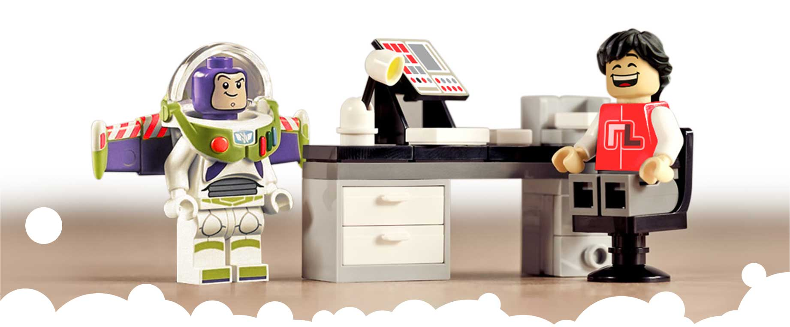
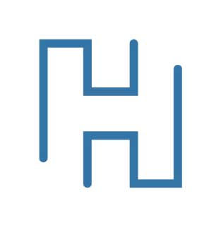

<!--#responsive-image {  width: 100%;  height: auto; } -->

### The Go-To-Guy • Fix-it Felix Sr • Winston Wolfe

Throughout my career, I've had the privilege of contributing significantly to various startups, spanning from boutique agencies to multinational corporations, including notable ventures in the e-commerce sector and even the world's largest toy company. My experience encompasses a broad spectrum of design roles, from conceptualization and guiding artistic direction to hands-on design implementation with meticulous attention to detail. This diverse skill set allows me to craft compelling and unified artistic visions tailored to different industries and scopes, making a meaningful and enduring mark on each brand.  

> Currently upskilling to Python with HyperionDev

 

<!-- Archived content -->
<!--### Hi there 👋 -->

<!--
`Currently upskilling to Python with HyperionDev`

**RobLightYear/RobLightYear** is a ✨ _special_ ✨ repository because its `README.md` (this file) appears on your GitHub profile.

Here are some ideas to get you started:

- 🔭 I’m currently working on ...
- 🌱 I’m currently learning ...
- 👯 I’m looking to collaborate on ...
- 🤔 I’m looking for help with ...
- 💬 Ask me about ...
- 📫 How to reach me: ...
- 😄 Pronouns: ...
- ⚡ Fun fact: ...
-->
