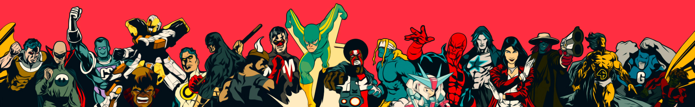

<!--#responsive-image {  width: 100%;  height: auto; } -->

### The Go-To-Guy • Fix-it Felix Sr • Winston Wolfe
p>

Throughout my career, I’ve played a pivotal role in shaping the identities of startups, ranging from boutique agencies to expansive multinational corporations, including multi-million dollar e-commerce enterprises and even the world’s biggest toy company. My expertise spans a wide spectrum, covering every facet of the design journey, from initial conceptualisation and artistic direction to meticulous design work and flawless execution. My diverse skill set enables me to create compelling and cohesive artistic visions across a range of industries and scales, leaving a lasting impact on every brand.  

<!--### Hi there 👋 -->

:closed_book: Currently working on Python with HyperionDev

<!--
**RobLightYear/RobLightYear** is a ✨ _special_ ✨ repository because its `README.md` (this file) appears on your GitHub profile.

Here are some ideas to get you started:

- 🔭 I’m currently working on ...
- 🌱 I’m currently learning ...
- 👯 I’m looking to collaborate on ...
- 🤔 I’m looking for help with ...
- 💬 Ask me about ...
- 📫 How to reach me: ...
- 😄 Pronouns: ...
- ⚡ Fun fact: ...
-->
